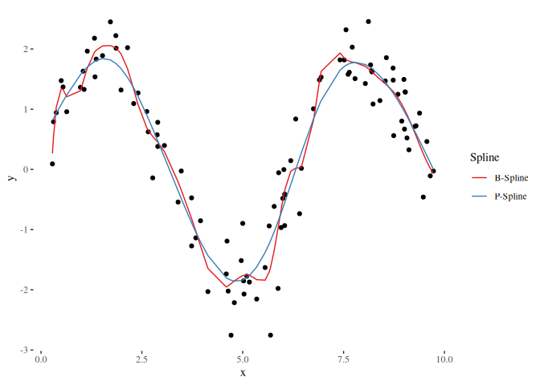

<!-- README.md is generated from README.Rmd. Please edit that file -->
[](https://travis-ci.org/schalkdaniel/compboostSplines) [](https://coveralls.io/github/schalkdaniel/compboostSplines)

C++ Spline Implementation of Compboost
--------------------------------------

This repository contains the spline implementation of [compboost](https://compboost.org) by providing the spline functions directly without any bloated code around it.

**Feel free to extend the algorithms, improve performance, or use for your own projets.**

Installation
------------

#### Developer version:

``` r
devtools::install_github("schalkdaniel/compboostSplines")
```

Examples
--------

-   [Spline Regression](#spline-regression)
-   [Demmler-Reinsch-Orthogonalization](#demmler-reinsch-orthogonalization)

### Spline Regression

This package can build spline bases for you, ether as dense or sparse matrix. With the matrix it is possible to do e.g. spline regression or other cool stuff:

``` r
library(compboostSplines)

nsim = 100

# Sample data:
x = sort(runif(nsim, 0, 10))
y = 2 * sin(x) + rnorm(nsim, 0, 0.5)

# Calculate knots of given x values:
knots = createKnots(values = x, n_knots = 20, degree = 3)

# Create basis using that knots:
basis = createSplineBasis(values = x, degree = 3, knots = knots)
basis[1:10, 1:10]
#>             [,1]    [,2]   [,3]      [,4]    [,5] [,6] [,7] [,8] [,9] [,10]
#>  [1,] 0.16666667 0.66667 0.1667 0.0000000 0.00000    0    0    0    0     0
#>  [2,] 0.10278868 0.64617 0.2505 0.0005491 0.00000    0    0    0    0     0
#>  [3,] 0.06394969 0.60216 0.3305 0.0034038 0.00000    0    0    0    0     0
#>  [4,] 0.05831301 0.59232 0.3451 0.0042941 0.00000    0    0    0    0     0
#>  [5,] 0.05392638 0.58380 0.3571 0.0051344 0.00000    0    0    0    0     0
#>  [6,] 0.03738148 0.54289 0.4097 0.0100718 0.00000    0    0    0    0     0
#>  [7,] 0.00164882 0.29210 0.6255 0.0807240 0.00000    0    0    0    0     0
#>  [8,] 0.00092759 0.26819 0.6380 0.0928339 0.00000    0    0    0    0     0
#>  [9,] 0.00001665 0.19089 0.6646 0.1445267 0.00000    0    0    0    0     0
#> [10,] 0.00000000 0.01703 0.4586 0.4992054 0.02517    0    0    0    0     0

# You can also create sparse matrices:
basis.sparse = createSparseSplineBasis(values = x, degree = 3, knots = knots)
str(basis.sparse)
#> Formal class 'dgCMatrix' [package "Matrix"] with 6 slots
#>   ..@ i       : int [1:398] 0 1 2 3 4 5 6 7 8 0 ...
#>   ..@ p       : int [1:25] 0 9 19 34 51 65 83 101 121 143 ...
#>   ..@ Dim     : int [1:2] 100 24
#>   ..@ Dimnames:List of 2
#>   .. ..$ : NULL
#>   .. ..$ : NULL
#>   ..@ x       : num [1:398] 0.1667 0.1028 0.0639 0.0583 0.0539 ...
#>   ..@ factors : list()

# Check if row sums add up to 1:
rowSums(basis)
#>   [1] 1 1 1 1 1 1 1 1 1 1 1 1 1 1 1 1 1 1 1 1 1 1 1 1 1 1 1 1 1 1 1 1 1 1 1 1 1 1 1 1 1 1 1 1 1 1 1
#>  [48] 1 1 1 1 1 1 1 1 1 1 1 1 1 1 1 1 1 1 1 1 1 1 1 1 1 1 1 1 1 1 1 1 1 1 1 1 1 1 1 1 1 1 1 1 1 1 1
#>  [95] 1 1 1 1 1 1

# Polynomial regression using b-splines:
beta = solve(t(basis) %*% basis) %*% t(basis) %*% y

# 20 knots may tend to overfit on the data, lets try p-splines with a penalty term of 4!
penalty = 4

# Get penalty matrix:
K = penaltyMat(ncol(basis), differences = 2)
K[1:6, 1:6]
#>      [,1] [,2] [,3] [,4] [,5] [,6]
#> [1,]    1   -2    1    0    0    0
#> [2,]   -2    5   -4    1    0    0
#> [3,]    1   -4    6   -4    1    0
#> [4,]    0    1   -4    6   -4    1
#> [5,]    0    0    1   -4    6   -4
#> [6,]    0    0    0    1   -4    6

# Get new estimator:
beta_pen = solve(t(basis) %*% basis + penalty * K) %*% t(basis) %*% y

# Lets visualize the curves:

library(ggplot2)
library(ggthemes)

plot_df = data.frame(
  x = x,
  y = y
)
spline_df = data.frame(
  "Spline" = c(rep("B-Spline", nsim), rep("P-Spline", nsim)),
  "x" = rep(x, 2),
  "y" = c(basis %*% beta, basis %*% beta_pen)
)

ggplot() + geom_point(data = plot_df, mapping = aes(x = x, y = y)) +
  geom_line(data = spline_df, mapping = aes(x = x, y = y, color = Spline)) +
  theme_tufte() + 
  scale_color_brewer(palette = "Set1")
```


### Demmler-Reinsch-Orthogonalization

In order to compare different models such as a linear model and additive model (using splines) we need to set the degrees of freedom equally. The Demmler-Reinsch-Orthogonalization can be used to translate given degrees of freedom to a penalty term:

``` r
# We use the basis and penalty matrix from above and specify 2 and 4 degrees of freedom: 
(penalty_df2 = demmlerReinsch(t(basis) %*% basis, K, 2))
#> [1] 66965556256
(penalty_df4 = demmlerReinsch(t(basis) %*% basis, K, 4))
#> [1] 443.5

# This is now used for a new estimator:
beta_df2 = solve(t(basis) %*% basis + penalty_df2 * K) %*% t(basis) %*% y
beta_df4 = solve(t(basis) %*% basis + penalty_df4 * K) %*% t(basis) %*% y

plot_df = data.frame(
  x = x,
  y = y
)
types = c("B-Spline", "P-Spline", "P-Spline with 2 df", "P-Spline with 4 df")
spline_df = data.frame(
  "Spline" = rep(types, each = nsim),
  "x" = rep(x, length(types)),
  "y" = c(basis %*% beta, basis %*% beta_pen, basis %*% beta_df2, basis %*% beta_df4)
)

ggplot() + geom_point(data = plot_df, mapping = aes(x = x, y = y)) +
  geom_line(data = spline_df, mapping = aes(x = x, y = y, color = Spline)) +
  theme_tufte() + 
  scale_color_brewer(palette = "Set1")
```



License
-------

© 2018 [Daniel Schalk](https://danielschalk.com)

The contents of this repository are distributed under the MIT license. See below for details:

> The MIT License (MIT)
>
> Copyright (c) 2018 Daniel Schalk
>
> Permission is hereby granted, free of charge, to any person obtaining a copy of this software and associated documentation files (the "Software"), to deal in the Software without restriction, including without limitation the rights to use, copy, modify, merge, publish, distribute, sublicense, and/or sell copies of the Software, and to permit persons to whom the Software is furnished to do so, subject to the following conditions:
>
> The above copyright notice and this permission notice shall be included in all copies or substantial portions of the Software.
>
> THE SOFTWARE IS PROVIDED "AS IS", WITHOUT WARRANTY OF ANY KIND, EXPRESS OR IMPLIED, INCLUDING BUT NOT LIMITED TO THE WARRANTIES OF MERCHANTABILITY, FITNESS FOR A PARTICULAR PURPOSE AND NONINFRINGEMENT. IN NO EVENT SHALL THE AUTHORS OR COPYRIGHT HOLDERS BE LIABLE FOR ANY CLAIM, DAMAGES OR OTHER LIABILITY, WHETHER IN AN ACTION OF CONTRACT, TORT OR OTHERWISE, ARISING FROM, OUT OF OR IN CONNECTION WITH THE SOFTWARE OR THE USE OR OTHER DEALINGS IN THE SOFTWARE.
