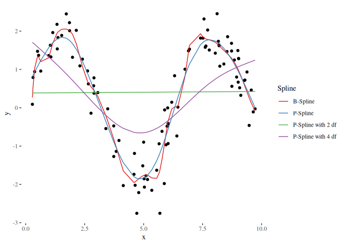
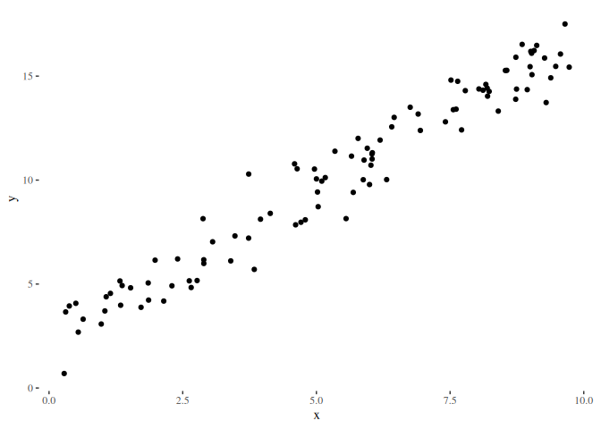
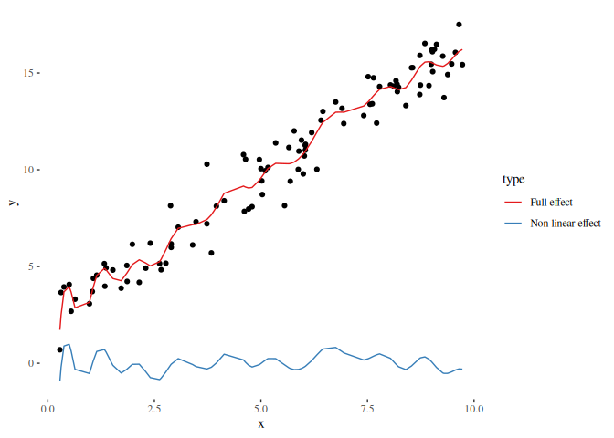
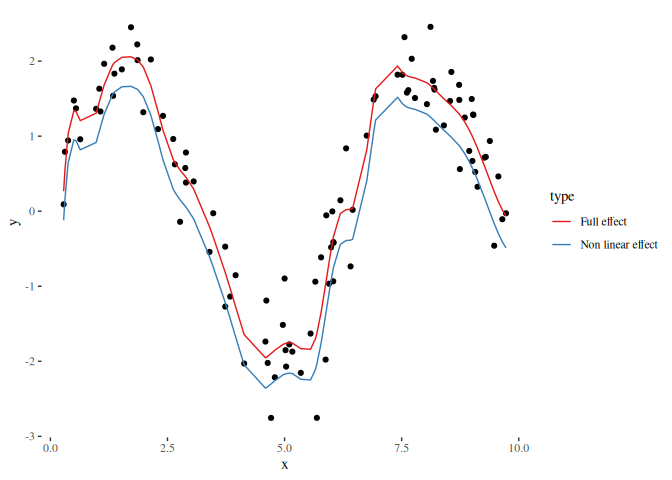
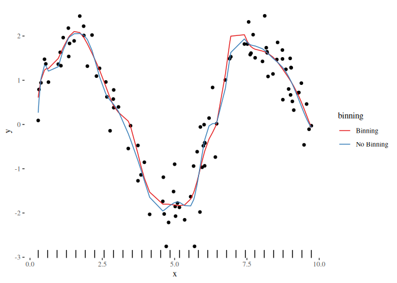

<!-- README.md is generated from README.Rmd. Please edit that file -->

[](https://github.com/schalkdaniel/cpsp/actions/workflows/R-CMD-check.yaml)
[](https://codecov.io/gh/schalkdaniel/cpsp)
[](https://www.gnu.org/licenses/lgpl-3.0)

## C++ Spline Implementation

The `cpsp` (**former `compboostSplines`**) package provides a pure
spline implementation written in `C++`. This repository can be used for
spline regression and non-parametric modelling of numerical features.
The functionality contains the basis creation, the
Demmler-Reinsch-Orthogonalization, building tensor products, an
efficient discretization technique to save memory, as well as a method
to subtract matrix bases.

**Feel free to extend the algorithms, improve performance, or use for
your own projets.**

## Installation

#### Developer version:

``` r
remotes::install_github("schalkdaniel/cpsp", ref = "main")
```

## Examples

### Spline basis

To create a spline basis call `createSplineBasis()` (for dense matrices)
and `createSparseSplineBasis()` (for sparse matrices):

``` r
library(cpsp)

nsim = 100

# Sample data:
x = sort(runif(nsim, 0, 10))
y = 2 * sin(x) + rnorm(nsim, 0, 0.5)

# Calculate knots of given x values:
knots = createKnots(values = x, n_knots = 20, degree = 3)

# Create basis using that knots:
basis = createSplineBasis(values = x, degree = 3, knots = knots)
str(basis)
#>  num [1:100, 1:24] 0.16667 0.00728 0.00342 0 0 ...

# You can also create sparse matrices:
basis_sparse = createSparseSplineBasis(values = x, degree = 3, knots = knots)
str(basis_sparse)
#> Formal class 'dgCMatrix' [package "Matrix"] with 6 slots
#>   ..@ i       : int [1:398] 0 1 2 0 1 2 3 4 5 6 ...
#>   ..@ p       : int [1:25] 0 3 10 24 42 63 87 110 130 154 ...
#>   ..@ Dim     : int [1:2] 100 24
#>   ..@ Dimnames:List of 2
#>   .. ..$ : NULL
#>   .. ..$ : NULL
#>   ..@ x       : num [1:398] 0.16667 0.00728 0.00342 0.66667 0.38296 ...
#>   ..@ factors : list()

# Check if row sums add up to 1:
rowSums(basis)
#>   [1] 1 1 1 1 1 1 1 1 1 1 1 1 1 1 1 1 1 1 1 1 1 1 1 1 1 1 1 1 1 1 1 1 1 1 1 1 1 1 1 1 1 1 1 1 1 1 1
#>  [48] 1 1 1 1 1 1 1 1 1 1 1 1 1 1 1 1 1 1 1 1 1 1 1 1 1 1 1 1 1 1 1 1 1 1 1 1 1 1 1 1 1 1 1 1 1 1 1
#>  [95] 1 1 1 1 1 1
```

### Spline regression

With that, it is straight forward to use the least squares estimator for
spline regression:

``` r
# Custom function to estimate the least squares estimator
myEstimator = function(X, y, penmat = 0, xtx = NULL, xty = NULL) {
  if (! (missing(X) || missing(y))) {
    xtx = crossprod(X)
    xty = crossprod(X, y)
  }
  L = chol(xtx + penmat)
  z = backsolve(L, xty, transpose = TRUE)
  return(as.vector(backsolve(L, z)))
}

# Polynomial regression using b-splines:
beta = myEstimator(basis, y)

# 20 knots may tend to overfit on the data, lets try p-splines with a penalty term of 4!
penalty = 4

# Get penalty matrix:
K = penaltyMat(ncol(basis), differences = 2)
K[1:6, 1:6]
#>      [,1] [,2] [,3] [,4] [,5] [,6]
#> [1,]    1   -2    1    0    0    0
#> [2,]   -2    5   -4    1    0    0
#> [3,]    1   -4    6   -4    1    0
#> [4,]    0    1   -4    6   -4    1
#> [5,]    0    0    1   -4    6   -4
#> [6,]    0    0    0    1   -4    6

# Get new estimator:
beta_pen = myEstimator(basis, y, penalty * K)

# Lets visualize the curves:

library(ggplot2)
library(ggthemes)

plot_df = data.frame(
  x = x,
  y = y
)
spline_df = data.frame(
  "Spline" = c(rep("B-Spline", nsim), rep("P-Spline", nsim)),
  "x" = rep(x, 2),
  "y" = c(basis %*% beta, basis %*% beta_pen)
)

ggplot() + geom_point(data = plot_df, mapping = aes(x = x, y = y)) +
  geom_line(data = spline_df, mapping = aes(x = x, y = y, color = Spline)) +
  theme_tufte() +
  scale_color_brewer(palette = "Set1")
```

<!-- -->

### Demmler-Reinsch-Orthogonalization

In order to compare different models such as a linear model and additive
model (using splines) we need to set the degrees of freedom equally. The
Demmler-Reinsch-Orthogonalization can be used to translate given degrees
of freedom to a penalty term:

``` r
# We use the basis and penalty matrix from above and specify 2 and 4 degrees of freedom:
(penalty_df2 = demmlerReinsch(t(basis) %*% basis, K, 2))
#> [1] 58987214677
(penalty_df4 = demmlerReinsch(t(basis) %*% basis, K, 4))
#> [1] 400.4572

# This is now used for a new estimator:
beta_df2 = myEstimator(basis, y, penalty_df2 * K)
beta_df4 = myEstimator(basis, y, penalty_df4 * K)

plot_df = data.frame(
  x = x,
  y = y
)
types = c("B-Spline", "P-Spline", "P-Spline with 2 df", "P-Spline with 4 df")
spline_df = data.frame(
  "Spline" = rep(types, each = nsim),
  "x" = rep(x, length(types)),
  "y" = c(basis %*% beta, basis %*% beta_pen, basis %*% beta_df2, basis %*% beta_df4)
)

ggplot() + geom_point(data = plot_df, mapping = aes(x = x, y = y)) +
  geom_line(data = spline_df, mapping = aes(x = x, y = y, color = Spline)) +
  theme_tufte() +
  scale_color_brewer(palette = "Set1")
```

<!-- -->

### Subtract model effects

The idea of subtracting effects is to not let a design matrix model the
effect represented in another matrix. For example, let’s define a linear
effect:

``` r
y_linear = 2 + 1.5 * x + rnorm(nsim)
df_linear = data.frame(x = x, y = y_linear)

ggplot() +
  geom_point(data = df_linear, aes(x = x, y = y)) +
  theme_tufte()
```

<!-- -->

The linear effect is expressed in the design matrix `(1, x)`. With
`getSubtractionRotation()` we can generate a rotation matrix which is
used to rotate the design matrix that the linear effect cannot modelled
anymore while the full design matrix still models the linear effect:

``` r
X_linear = cbind(1, x)
X_nonlinear = basis %*% getSubtractionRotation(basis, X_linear)

pred_full = basis %*% myEstimator(basis, y_linear)
pred_nonlinear = X_nonlinear %*% myEstimator(X_nonlinear, y_linear)

df_plot = data.frame(
  x = rep(x, 2),
  y = c(pred_nonlinear, pred_full),
  type = rep(c("Non linear effect", "Full effect"), each = length(x)))

ggplot() +
  geom_point(data = data.frame(x = x, y = y_linear), aes(x = x, y = y)) +
  geom_line(data = df_plot, aes(x = x, y = y, color = type)) +
  theme_tufte() +
  scale_color_brewer(palette = "Set1")
```

<!-- -->

If we use the non-linear effect from the first examples, we observe that
both, the reduced and full design matrix can capture the non-linear
effect. The only differences observable is the shift on the y axis which
results from the subtraction of a constant, meaning that the estimated
effect is always centered around zero if the design matrix of the linear
effect contains a constant column:

``` r
beta_nonlinear_nl = myEstimator(X_nonlinear, y)
pred_nonlinear_nl = X_nonlinear %*% beta_nonlinear_nl

df_plot_nl = data.frame(
  x = rep(x, 2),
  y = c(pred_nonlinear_nl, basis %*% beta),
  type = rep(c("Non linear effect", "Full effect"), each = length(x)))

ggplot() +
  geom_point(data = data.frame(x = x, y = y), aes(x = x, y = y)) +
  geom_line(data = df_plot_nl, aes(x = x, y = y, color = type)) +
  theme_tufte() +
  scale_color_brewer(palette = "Set1")
```

<!-- -->

### Binning

Using binning allows to reduce the number of observations in the design
matrix. Therefore, the vector `x` is discretized into a smaller amount
of bins. Furthermore, a mapping keeps the information, which of the bins
represents which original value. Efficient algorithms are design based
on this information:

``` r
bins = binVectorCustom(x, 30)

# Note the +1 shift induced by the C++ indexing starting at 0 not 1
idx = calculateIndexVector(x, bins) + 1

head(data.frame(x = x, bins = bins[idx]))
#>            x       bins
#> 1 0.05403692 0.05403692
#> 2 0.35810175 0.39394676
#> 3 0.39497409 0.39394676
#> 4 0.57177026 0.73385660
#> 5 0.61706966 0.73385660
#> 6 0.79349607 0.73385660
```

For spline regression, we can build the basis just using the bins and
use this (much) smaller design matrix with the optimized algorithms:

``` r
# To process sparse matrices we have to load the `Matrix` package:
library(Matrix)

# Dummy weight vector:
w = rep(1, length(idx))

# Design matrix based on the bins (not the full vector):
basis_bin = createSparseSplineBasis(values = bins, degree = 3, knots = knots)

# Compare object sizes:
object.size(basis_bin)
#> 3040 bytes
object.size(basis)
#> 19416 bytes

# Calculate estimator:
xtx = binnedSparseMatMult(t(basis_bin), idx - 1, w)
xty = binnedSparseMatMultResponse(t(basis_bin), y, idx - 1, w)
beta_bin = myEstimator(xtx = xtx, xty = xty)

df_bin = data.frame(
  x = rep(x, 2),
  y = c(basis %*% beta, basis %*% beta_bin),
  binning = rep(c("No Binning", "Binning"), each = length(x)))

ggplot() + geom_point(data = plot_df, mapping = aes(x = x, y = y)) +
  geom_line(data = df_bin, mapping = aes(x = x, y = y, color = binning)) +
  theme_tufte() +
  geom_rug(aes(x = bins)) +
  scale_color_brewer(palette = "Set1")
```

<!-- -->
